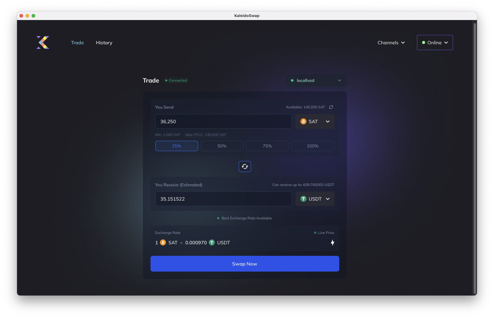

# Kaleidoswap Desktop App


## Table of Contents

- [Kaleidoswap Desktop App](#kaleidoswap-desktop-app)
  - [Table of Contents](#table-of-contents)
  - [Overview](#overview)
  - [Screenshots](#screenshots)
  - [Features 🚀](#features-)
  - [Supported Networks](#supported-networks)
  - [Installation 🛠️](#installation-️)
    - [1. Download Binaries](#1-download-binaries)
    - [2. Building Locally](#2-building-locally)
      - [Common Prerequisites](#common-prerequisites)
      - [Windows-Specific Instructions](#windows-specific-instructions)
      - [Linux-Specific Instructions](#linux-specific-instructions)
      - [Building and Running](#building-and-running)
  - [Usage 💡](#usage-)
    - [Connecting to an RGB Lightning Node](#connecting-to-an-rgb-lightning-node)
    - [Trading and Swapping Assets](#trading-and-swapping-assets)
    - [Managing Channels](#managing-channels)
    - [Deposits and Withdrawals](#deposits-and-withdrawals)
    - [Backup](#backup)
  - [Security Considerations 🔒](#security-considerations-)
  - [Roadmap 🛣️](#roadmap-️)
    - [Coming Soon](#coming-soon)
  - [Contributing 🤝](#contributing-)
    - [How to Contribute](#how-to-contribute)
  - [Support 📞](#support-)
  - [License 📜](#license-)

## Overview

Kaleidoswap is a cutting-edge, open-source desktop application that facilitates decentralized, trustless trading of digital assets over the Bitcoin Lightning Network using the RGB protocol.
 Built with [Tauri](https://tauri.app/), Kaleidoswap offers users a streamlined interface to connect with RGB Lightning nodes—whether running locally or remotely—and engage in seamless asset swaps.

By leveraging RGB's unique smart contract capabilities, Kaleidoswap allows for multi-asset trading on top of Bitcoin without relying on intermediaries, preserving sovereignty over your assets. The app integrates Lightning Service Providers (LSPs) to manage liquidity and channels, enabling efficient, atomic asset swaps for assets like Bitcoin and RGB tokens.

Kaleidoswap's primary features include opening and managing Lightning channels, handling deposits and withdrawals, and providing a powerful trading interface. It is particularly tailored for users wanting to tap into the RGB protocol's power on Lightning, without compromising on user experience or security.

**Note:** Kaleidoswap is designed for testing on networks like regtest, signet, and testnet3. Mainnet use is not recommended at this stage.


## Screenshots  



## Features 🚀

- **Asset Trading and Swapping:** Interact with market makers using the [RGB Lightning DEX API](https://github.com/kaleidoswap/docs) to trade assets trustlessly. 🎯
- **Lightning Channel Management:** Easily open, close, and manage channels with optional RGB assets. ⚡
- **Deposits & Withdrawals:** Handle both on-chain and Lightning Network transactions for Bitcoin and RGB assets. 💸
- **Channel Requests:** Customize and request channels from LSPs with specific parameters like liquidity and RGB assets. 🔧
- **Transaction History:** Keep track of your deposits, withdrawals, and swaps. 📊
- **Node Backup:** Secure your node's data with a backup option available in the settings page. 🔐
- **Customizable LSP:** Swap with a single LSP by default, or modify your LSP settings for different makers. 🔄

## Supported Networks

- **Regtest**
- **Signet**
- **Testnet3**

⚠️ **Note:** Kaleidoswap is still in alpha and should not be used with real money on mainnet.

## Installation 🛠️

You can install the app in two ways:

### 1. Download Binaries

1. Download the appropriate binary for your OS from the [Releases](https://github.com/kaleidoswap/desktop-app/releases) page.
2. Download both the binary file and its corresponding `.sig` signature file.
3. Import our public GPG key:
   ```sh
   curl https://raw.githubusercontent.com/kaleidoswap/desktop-app/main/public-key.asc | gpg --import
   ```
4. Verify the signature:
   ```sh
   # For Linux
   gpg --verify kaleido-swap_0.0.1_amd64.AppImage.sig kaleido-swap_0.0.1_amd64.AppImage
   
   # For macOS
   gpg --verify Kaleido-Swap_0.0.1_x64.dmg.sig Kaleido-Swap_0.0.1_x64.dmg
   
   # For Windows
   gpg --verify Kaleido-Swap_0.0.1_x64-setup.exe.sig Kaleido-Swap_0.0.1_x64-setup.exe
   ```
5. Verify the SHA256 checksum of the binary.
6. Extract the downloaded file (if applicable).
7. Run the app by executing the binary. 

### 2. Building Locally

#### Common Prerequisites

Before building Kaleidoswap locally, you need:

1. **Tauri 1.6.0**  
   Make sure you have installed all the [official Tauri prerequisites](https://tauri.app/v1/guides/getting-started/prerequisites). This includes:
   - **Rust** (and the corresponding toolchain)
   - **Node.js**  
   - **npm**  
   - **pnpm** for installing Tauri
  
2. **Repository**  
   Clone the project repository:
   ```sh
   git clone https://github.com/kaleidoswap/desktop-app
   cd desktop-app
   ```
#### Windows-Specific Instructions
1. **Disable RLN Integration (Temporarily)**
   - The `rgb-lightning-node (RLN)` integration is not fully supported on Windows yet.
   - If you still want to experiment with RLN on Windows, you can run it in a Docker container locally without integrating it directly into the Kaleidoswap build.
2. **Install vcpkg**
   - Windows requires [vcpkg](https://github.com/microsoft/vcpkg) (the equivalent of pkg-config) to install certain libraries.
   - Using vcpkg, install **openssl** and **sqlite3**.
3. **MSVC for C++ Linking**
   - You must have **Microsoft Visual C++ (MSVC)** installed, typically provided with Visual Studio or Visual Studio Build Tools.
4. **(Future) CMake for RLN**
   - Once RLN support on Windows is optimized, you will also need **CMake** for building RLN itself.
   - Currently, with RLN disabled, CMake is not strictly required.

#### Linux-Specific Instructions
1. **Basic Build Tools and Libraries**
   - Install standard build tools (e.g., `build-essential` on Debian/Ubuntu or the equivalent on other distros).
   - Ensure **pkg-config** and the **SSL libraries** are installed.
2. **libsoup and javascriptcoregtk**
   - Tauri requires **libsoup 2.4**, **javascriptcoregtk 4.0** and **webkit2gtk 4.0**.
   - Some newer distributions (e.g., recent Ubuntu versions) may only provide gtk libraries from version 4.1. If so, install the 4.0 versions manually.
3. **Rust, Node.js, npm, pnpm**
   - Follow the [Tauri documentation](https://tauri.app/v1/guides/getting-started/prerequisites) to ensure your environment is correctly set up.
   - Make sure you have the appropriate Rust toolchain, Node.js, npm, and pnpm installed.

#### Building and Running
Once you have met the prerequisites for your operating system, proceed with the following steps:
1. **Enter the repository folder:**
    ```sh
    cd desktop-app
    ```
2. **Install dependencies:**
    ```sh
    npm install
    ```
3. **Build the Tauri app:**
    ```sh
    tauri build
    ```
4. Run Kaleidoswap in development mode:
    ```sh
    tauri dev
    ```

## Usage 💡

### Connecting to an RGB Lightning Node

1. Launch the Kaleidoswap App.
2. Connect to your RGB Lightning Node by either:
   - Running a local instance of [rgb-lightning-node](https://github.com/RGB-Tools/rgb-lightning-node), or
   - Connecting to a remote RGB Lightning Node.
3. Configure the connection settings via the settings page.

### Trading and Swapping Assets

- Before trading, ensure you have at least one channel with the LSP containing one of the supported assets and enough liquidity.
- If you don’t have a channel yet, you can buy one with an optional asset via the **Order Channel** page using the [RGB version of the LSPS1 protocol](https://github.com/RGB-OS/rgb-lsp-spec).
- Select a market maker (LSP) and choose trading pairs from the list provided.
- Prices are streamed using RFQ mode. Agree to a price to proceed with the swap.

### Managing Channels

- **Open Channels**: Create new Lightning channels with optional RGB assets.
- **Close Channels**: Close existing channels safely.
- **Request Channels from LSP**: Customize channel parameters such as satoshi capacity, RGB assets, and liquidity.

### Deposits and Withdrawals

- Deposit or withdraw Bitcoin and RGB assets either on-chain or via the Lightning Network.
- View the detailed history of all transactions in the app.

### Backup

- Back up your node data from the settings page to secure your setup.

## Security Considerations 🔒

- **Always-online node recommended:** To maintain the Lightning Network's security model, consider using a remote node or keeping your local node online.
- **API Authentication Warning:** Currently, the node API does not include authentication. Avoid exposing your node to untrusted networks.
- **Alpha Software Warning:** This is alpha software. **Do not use with real funds on the mainnet.**

## Roadmap 🛣️

### Coming Soon

- **🌍 Multi-language Support:** Broaden accessibility by adding support for multiple languages.
- **💼 Multi-maker RFQ:** Allow users to query prices from multiple makers (LSPs) simultaneously for better trading options.
- **📊 Advanced Trading Dashboard:** Support for limit orders, stop-loss, and more advanced trading features.
- **🔗 P2P Trading via Nostr:** Enable decentralized peer-to-peer trading using the Nostr protocol.
- **🔐 TOR Support:** Integrate TOR for enhanced privacy and anonymity.
- **✨ Improved UI/UX Design:** Further refine the user interface for a better overall experience.

## Contributing 🤝

Contributions are highly welcome! Whether it's reporting bugs, suggesting features, or submitting pull requests, your input helps improve Kaleidoswap.

### How to Contribute

1. Fork the repository.
2. Clone your fork:

    ```sh
    git clone https://github.com/your-username/kaleidoswap.git
    cd kaleidoswap
    ```

3. Create a new branch:

    ```sh
    git checkout -b feature/YourFeatureName
    ```

4. Make your changes and commit them with a clear message.
5. Push to your fork:

    ```sh
    git push origin feature/YourFeatureName
    ```

6. Open a pull request.

## Support 📞

For any questions, issues, or feature requests, open an issue in the [Issues section](https://github.com/kaleidoswap/desktop-app) of the repository.

## License 📜

Kaleidoswap is licensed under the [MIT License](LICENSE.md).
