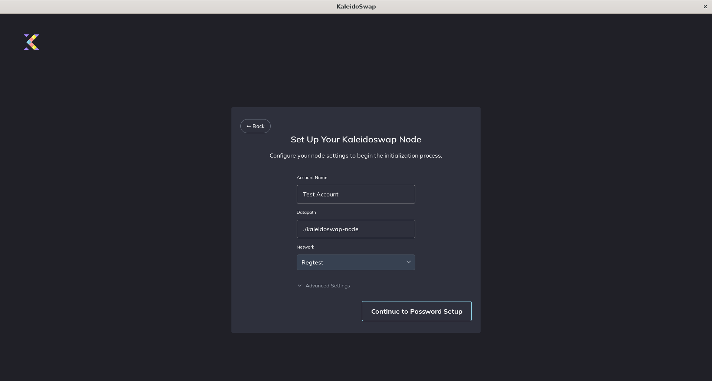
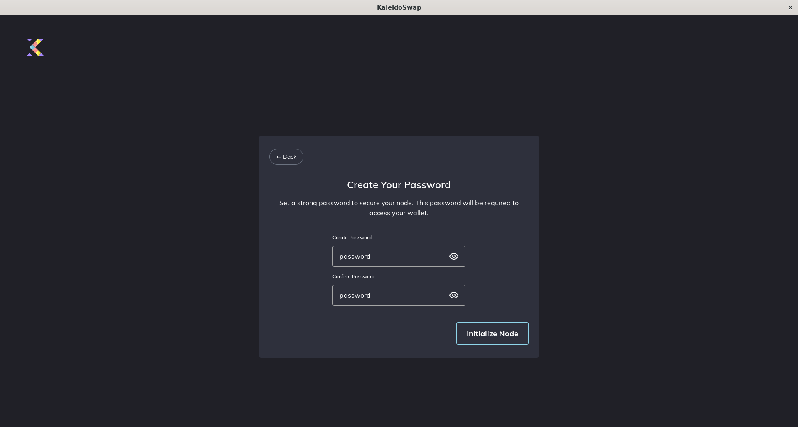
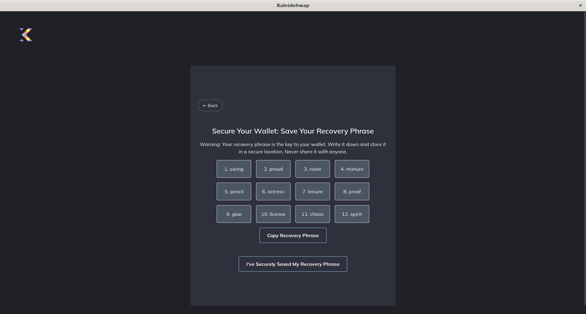
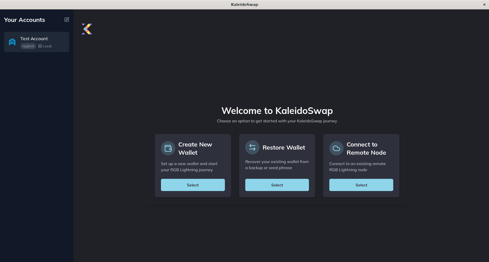

# Creating a New Wallet

[← Back to Documentation](README.md)

When you first launch the app, you'll need to create a new wallet. You have two options:

## Create New Wallet

A local RGB node stores data on the device from which you are launching the application.

1. **Select "Create New Wallet"**: Choose "Set Up Your Kaleidoswap Node" and select the network you want to use, the datapath where the data will be stored, and a name for your account. 
2. **Set a Secure Password**: Enter a strong password to protect your wallet. 
3. **Backup**: After the node has been initialized, write down the mnemonic phrase provided and store it securely. 

## Select Account

From the left menu you can select an account that has been saved previously, even if it has not been initialized.

1. **Select Account**: From the menu on the left.
2. **Unlock Wallet** Enter the previously generated password to unlock the local RGB Lightning Node instance.
3. **Set Credentials**: Enter a strong password and any additional required information.
4. **Backup**: Ensure you save any backup phrases or keys provided.

---

*Next: [Initializing with Mnemonic Backup](InitializingMnemonic.md)*
