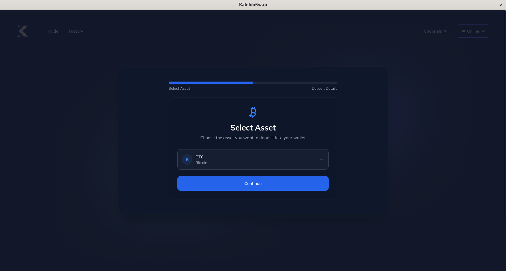
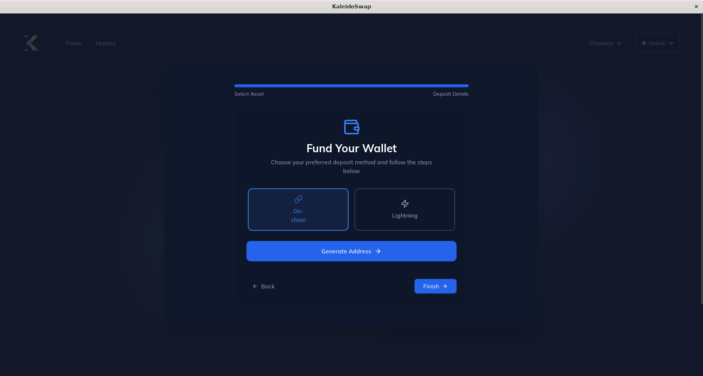
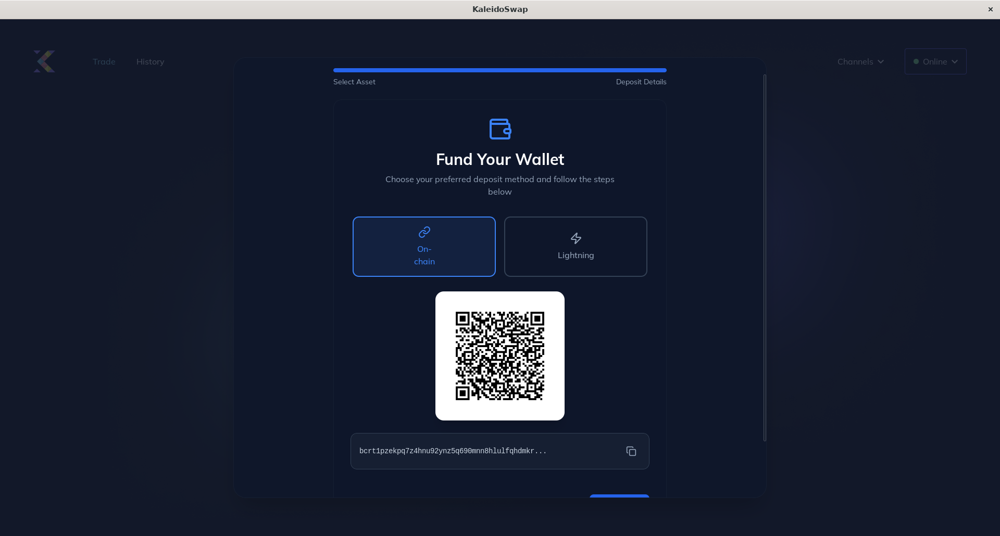
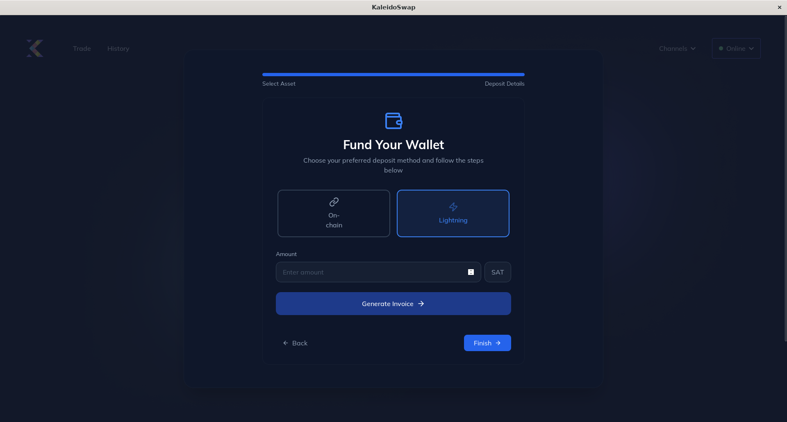
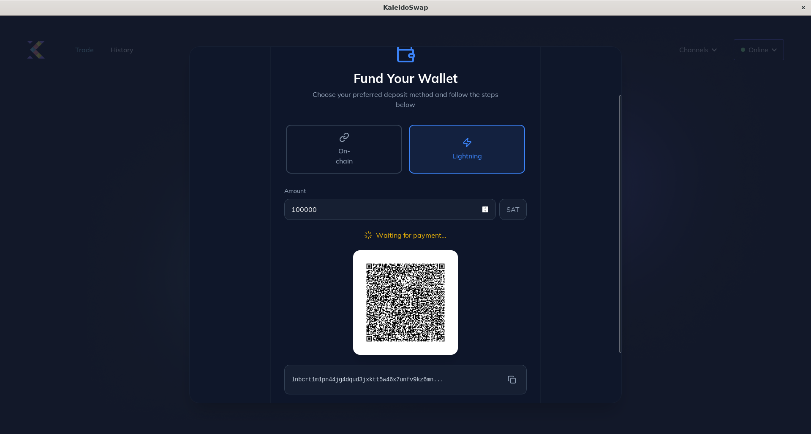
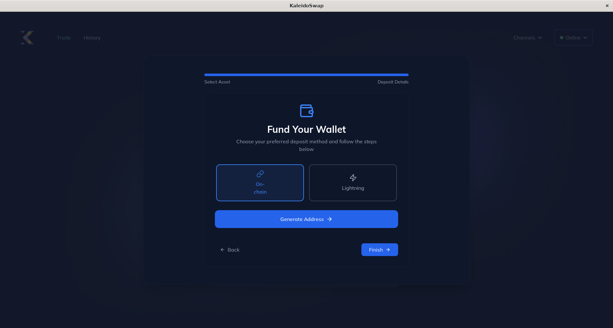
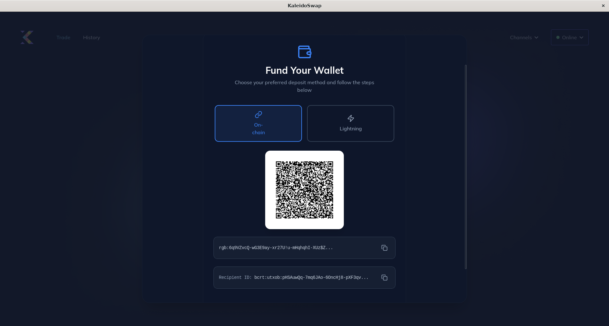
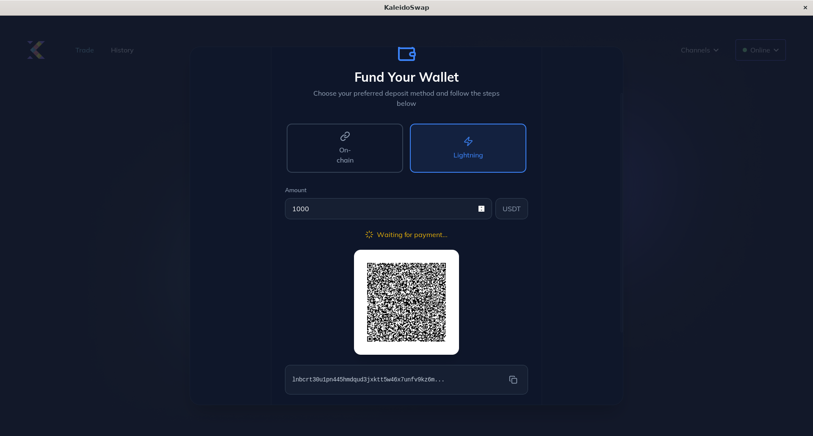

# Deposits

[← Back to Documentation](README.md)

Depositing funds into your wallet is straightforward.

## Depositing Bitcoin

1. **Navigate to "Channels"**: Click on the "Channels" tab. 
2. **Choose Asset**: Select BTC from the drop-down menu.
3. **Deposit Method**: Click on one of two available methods to deposit assets: onchain or Lightning Network.  
4. **Copy Address**: If you have selected the onchain method, then you will need to copy the automatically generated address to deposit the desired amount of assets. 
5. **Generate Lightning Invoice**: If you selected deposit by LN, then you will need to introduce the amount of assets you want to deposit to generate an invoice.  

## Depositing RGB Assets

1. **Choose Asset**: Repeat steps 1 and 2 in the previous section, but this time select one of the registered assets or upload one using its asset ID. In this example we will use USDT. 
2. **Deposit Method**: Click on one of two available methods to deposit assets: onchain or Lightning Network. 
3. **Copy Recipient ID**: If you have selected the onchain method, then you will need to copy the automatically generated `recipient id` to deposit the desired amount of assets with the corresponding id. 
4. **Generate Lightning Invoice**: If you selected deposit by LN, then you will need to introduce the amount of assets you want to deposit to generate an invoice. 

---

*Next: [Withdrawals](Withdrawals.md)*
