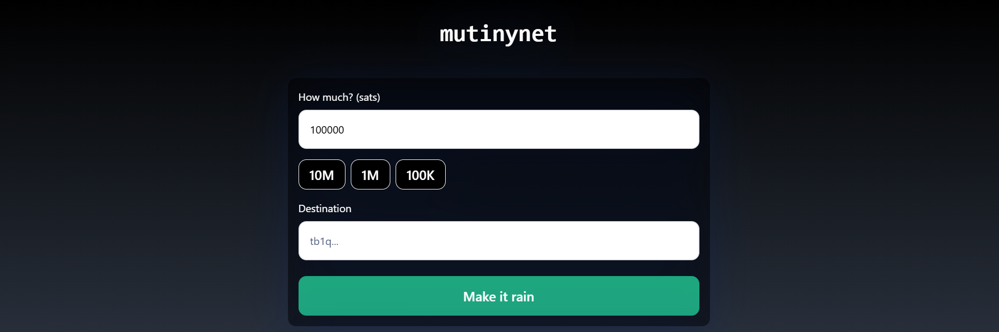

# Funding Your Bitcoin Wallet

[← Back to Documentation](README.md)

Before you can transact, you'll need to fund your wallet with Bitcoin.

## Obtaining a New Address

Follow the steps already taken in the [deposit](Deposits.md) section.

1. **Navigate to "Channels"**: Navigate to "Channels" and click on the "Deposit" tab from the dropdown menu.
2. **Generate BTC Address**: Select BTC from assets menu and click "Continue" and "On-chain" to create a Bitcoin receiving address.
3. **Copy Address**: Use the provided button to copy the address to your clipboard.

## Using the Mutiny Faucet

For testnet coins, you can use the [Mutiny Faucet](https://faucet.mutinywallet.com/):

1. **Visit Mutiny Faucet**: Go to [faucet.mutinywallet.com](https://faucet.mutinywallet.com/). 
2. **Select SATs Amount**: Enter the desired amount of SATs in the field "How much?".
3. **Paste Address**: Enter the copied signet Bitcoin address in the “Destination” field of the faucet.
4. **Request Coins**: Click "Make it rain" to receive testnet Bitcoins.
5. **Confirm Receipt**: Check your wallet to confirm the funds have arrived.

---

*Next: [Opening a New Channel](OpeningChannel.md)*
