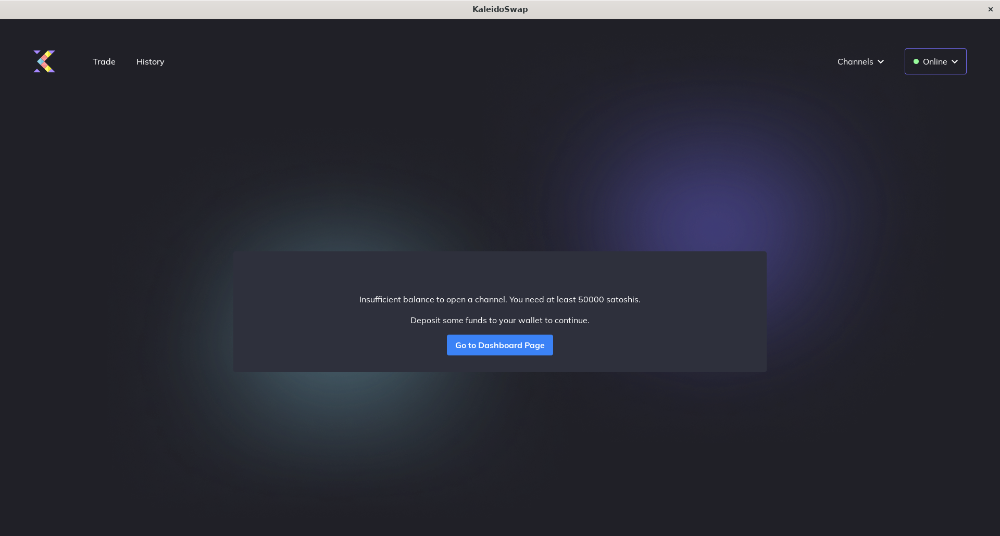

# Opening a New Channel

[← Back to Documentation](README.md)

To use the Lightning network, it is necessary to open channels. You can open channels with or without RGB resources, but you will need at least 50,000 SATs. 

## Options

- [Opening a New Channel Without Assets](OpeningChannelWithoutAssets.md)
- [Opening a New Channel With Assets](OpeningChannelWithAssets.md)

---

*Next: [Channel Backups](ChannelBackups.md)*
