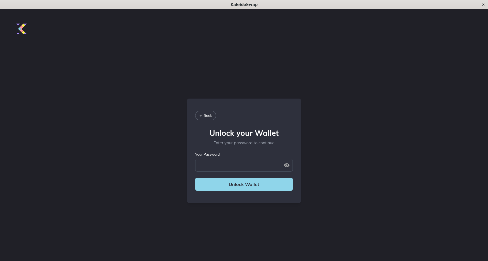

# Unlocking Your Wallet

[← Back to Documentation](README.md)

To access your wallet features, you'll need to unlock it each time you open the app.

1. **Enter Password**: Input the password you set during wallet creation. 
2. **Select Network**: Choose the appropriate network (e.g., Mainnet, Testnet).

## Understanding Unlock Parameters

- **Password**: Protects access to your wallet.
- **Network Selection**: Determines which blockchain network you interact with.
- **Advanced Settings**: Configure the node connections, i.e. RPC auth to Bitcoin Core and the Electrum indexer address, or the RGB proxy and port settings used by RGB Lightning Node to communicate with the app.

---

*Next: [Settings](Settings.md)*
