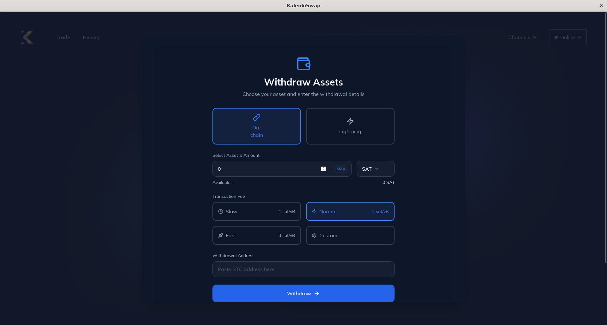
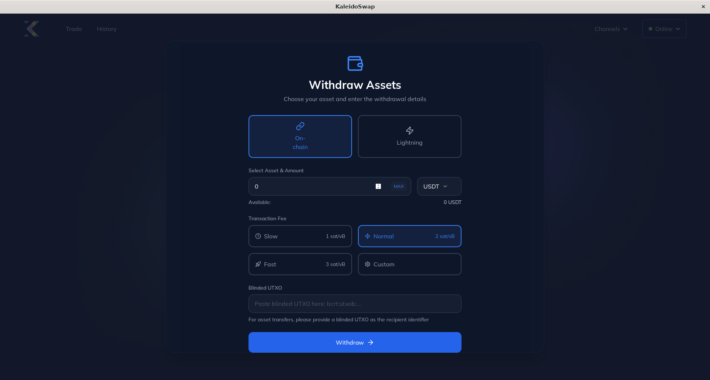

# Withdrawals

[← Back to Documentation](README.md)

Withdrawing funds from your wallet allows you to send Bitcoin or RGB assets to other addresses.

## Withdrawing Bitcoin

1. **Navigate to "Channels"**: Click on the "Withdraw" tab. 
2. **Withdrawal Method**: Select the method of withdrawal: onchain or Lightning Network. 
3. **Enter Amount**: Specify the amount of Bitcoin to send for onchain transaction.
4. **Fee Rate**: slow, normal or fast for onchain transaction.
5. **Withdrawal Address**: The address on which the BTC will be deposited.
6. **Invoice**: If you chose LN, then simply paste the invoice. 
7. **Review Transaction**: Double-check the details.
8. **Confirm and Send**: Click "Withdraw" to initiate the transaction.

## Withdrawing RGB Assets

1. **Enter Amount**: Repeat steps 1 and 2 followed to withdraw BTC in the previous section.
2. **Differences with BTC Withdrawal**: The steps to withdraw generic assets are almost identical to those required to withdraw BTC with the only difference being that onchain you will need to specify the `blinded UTxO` instead of the address. 

---

*Next: [Funding Your Bitcoin Wallet](FundingWallet.md)*
